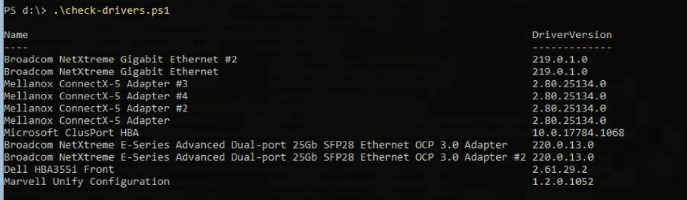
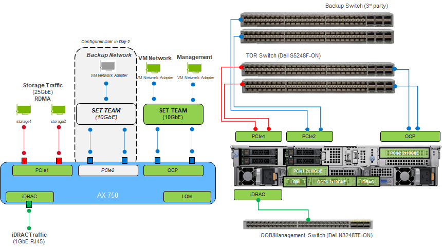
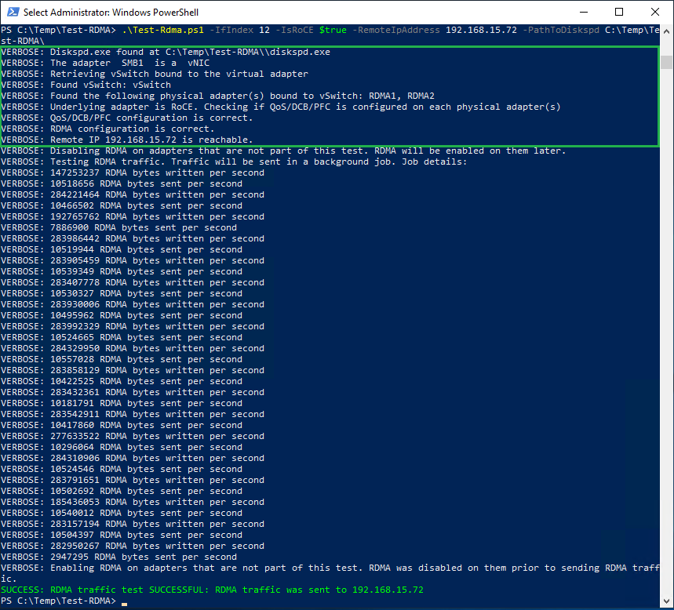

# Deployment PowerShell Scripts Compilation

This script is applicable to:
1. Azure Stack HCI Operating System, version 22H2
2. Dell Integrated System for Azure Stack HCI Hardware delivered from Dell (a.k.a AX nodes)
3. Scalable network options with RDMA capable TOR switches using Dell Switches and Non-Converged Network (separate Storage traffic and VM/Management Traffic)
4. The sequence of the script and its content is following [ E2E Deployment and Operation Guide ](https://infohub.delltechnologies.com/t/guides-74/), but adjusted to the following condition which may occur in customer environment:
    * Uplink to internet and management network are not up yet or will only be up after all the deployment prerequisite are done
    * Proxy and Firewall policy are in place in customer environment
    * Multiple physical NIC is ordered but not used for cluster (for other application purposes like backup)

## Deployment Prerequisite
1. AX nodes and TOR switches are racked and stacked and powered-on according to the [ deployment worksheet ](Deployment-Prerequisite-29032023.xlsx)
2. All Network switches are configured according deployment worksheet above, please check on how to configure the switch [here](https://infohub.delltechnologies.com/t/reference-guide-switch-configurations-roce-only-mellanox-cards/).
3. Active Directory are in-place with users setup as Admin and **Local Administrator Group** in each of cluster nodes
4. Best practice is to create a new OU and setup rights to create new objects inside the OU.
5. DNS are in-place and FQDN are resolved for related IP address configured
6. Download [ISO image](AX-Deployment-Script.iso) which consists all the scripts provided in this repo and mount as virtual media, copy the script into C:\Script and run all the script one by one following the task below.

## PreDeployment Configuration

### Task 01 - Configuring iDRAC and BIOS
* AX nodes are pre-installed with HCI OS and an optimized BIOS and iDRAC settings, however after racked and stacked and connected to TOR switch and OOB switch, if the OOB network in the environment does not provide DHCP IP addresses for iDRAC, you must manually set a static IPv4 address on each iDRAC network interface. You can access the physical server console to set the addresses by using KVM or other means.
* Perform the following steps to configure iDRAC IPv4 addresses in each hosts:
1. During the system boot, press F12.
2. At **System Setup Main Menu**, select **iDRAC Settings**.
3. Under **iDRAC Settings**, select **Network**.
4. Under **IPV4 SETTINGS**, at **Enable IPv4**, select **Enabled**.
5. Enter the static IPv4 address details.
6. Click **Back**, and then click **Finish**.

### Task 02 - Verifying Pre-installed OS and firmware/bios/driver compliance against Support Matrix
* Most of the time the pre-installed OS and firmware/bios/driver has been installed with up to date release, but to make sure please check again here before we connect to uplink network.
* Run the [Get-DellComputerInfo](Get-DellComputerInfo.ps1) script to check installed OS and it's version.
* The result of the script will look like this:

* Run the [Get-DellDeviceDriver](Get-DellDeviceDriver.ps1) script to check installed drivers and firmware and check with latest [Support Matrix](https://dell.github.io/azurestack-docs/docs/hci/supportmatrix/)
* The result of the script will look like this:

* Download firmware and BIOS from [Dell Support](https://www.dell.com/support/home/en-us) and update manually using iDRAC with the following guide: [ How to Update Firmware using iDRAC](https://www.dell.com/support/kbdoc/en-us/000134013/dell-poweredge-update-the-firmware-of-single-system-components-remotely-using-the-idrac#:~:text=Update%20Firmware%20Using%20iDRAC9&text=Go%20to%20Maintenance%20%3E%20System%20Update,Local%20as%20the%20Location%20Type.&text=Click%20Browse%2C%20select%20the%20firmware,component%2C%20and%20then%20click%20Upload.).
* Download the driver from [Dell Support](https://www.dell.com/support/home/en-us) and update them manually using DRM as mentioned in the reference [here](https://www.dell.com/support/kbdoc/en-us/000177083/support-for-dell-emc-repository-manager-drm).

### Task 03 - Configuring Network Switches
* Customize config here [TOR-Switch-A.conf](TOR-Switch-A.conf) and [TOR-Switch-B.conf](TOR-Switch-B.conf) based on deployment workbook.
* Config should be imported per TOR switches (TOR switch A and B)

### Task 04 - Changing Hostname
* Change the hostname according to your organization's standard convention naming.
* Use **sconfig** to change hostname or use the following script [Change-Hostname](Change-Hostname.ps1)
* Script should be executed per Host

### Task 05 - Non-Converged Host Network Configuration
* This script [Set-DellHostNetwork](Set-DellHostNetwork.ps1) will set IP address, VlanId and Switch-Embedded-Teaming for VM, Management and Storage Traffic.
* This script also disabled Network Adapter which are not currenlty being used to prevent being added as Cluster Network (except for Ethernet RNDIS adapter which are used for iDRAC to OS redfish interface)
* Script should be executed per Host
* Sample of Physical Network Adapter in AX-750 mapping (adjust per customer requirement):

| Name                      | InterfaceDescription                    | ifIndex | Status       | IP Address (sample)  | Vlan (sample) | Purpose                     |
| ------------------------- | --------------------------------------- | ------- | ------------ | -------------------- | ------------- | --------------------------- |
| Slot 3 Port 1             | Mellanox ConnectX-5 adapter #3          | 17      | Up           | 192.168.101.11/24    | 101           | S2D Traffic (RDMA/Jumbo)    | 
| Slot 3 Port 2             | Mellanox ConnectX-5 adapter #4          | 8       | Up           | 192.168.102.11/24    | 102           | S2D Traffic (RDMA/Jumbo)    |
| Integrated NIC 1 Port 1-1 | Broadcom NetXtreme E-Series Advanced    | 11      | Up           | N/A                  | N/A           | Data and Management Traffic |
| Integrated NIC 1 Port 2-1 | Broadcom NetXtreme E-Series Advanced #2 | 10      | Up           | N/A                  | N/A           | Data and Management Traffic |
| vEthernet (Management)    | Hyper-V Virtual Ethernet Adapter        | 14      | Up           | 10.189.192.62/24     | Untagged      | vNIC for Data/Management    |
| Slot 6 Port 1             | Mellanox ConnectX-5 adapter             | 2       | Disconnected | N/A                  | N/A           | Backup Traffic (Not Used)   |
| Slot 6 port 2             | Mellanox ConnectX-5 adapter #2          | 9       | Disconnected | N/A                  | N/A           | Backup Traffic (Not Used)   |
| Embedded NIC 1            | Broadcom NetXtrem Gigabit Ethernet #2   | 7       | Disconnected | N/A                  | N/A           | Backup Traffic (Not Used)   |
| Embedded NIC 2            | Broadcom NetXtrem Gigabit Ethernet      | 3       | Disconnected | N/A                  | N/A           | Backup Traffic (Not Used)   |

* The following Diagram illustrates the Host Network architecture for Scalable Non-Converged design:


### Task 06 - Update Network Adapter Advanced Properties
* Run [Set-DellNetAdapterAdvancedProperty](Set-DellNetAdapterAdvancedProperty.ps1) script
* Script should be executed per Host
* Script will configure based on Network Adapter Type (QLogic will use iWARP, Mellanox will use ROCEv2)

### Task 07 - Enable RDMA on Storage Adapters
* Run [Enable-DellNetAdapterRdma](Enable-DellNetAdapterRdma.ps1) script
* Script should be executed per Host
* Only Storage Adapters will be RDMA enabled

### Task 08 - Configure DCB and QoS on each of the Hosts - for RDMA ROCEv2 only
* Run [Set-DellNetQos](Set-DellNetQos.ps1) script
* Script should be executed per Host
* DCB and QoS must be set on TOR switches and the Hosts as the following tables:

| QoS Priority  | QoS Flow Control | % Bandwidth | Purpose                  |
| ------------- | ---------------- | ----------- | ------------------------ |
| 0-2,4,6,7     | Disabled         | N/A         | 0 - Best effort traffic  |
| 3             | Enabled          | 50          | SMB/RDMA                 |
| 5             | Disabled         | 2           | Cluster Network          |

* Manually disable DCB on the management adapters using the command Disable-NetAdapterQos <nicName>.
  
### Task 09 - Enable Jumbo Frame
* Run [Set-JumboFrame](Set-JumboFrame.ps1) script
* Script should be executed per Host
* Only Storage Adapters will be set with Jumbo Frame
   
### Task 10 - Validate RDMA
* Run the [Test RDMA Script](Test-Rdma.ps1) with the following examples:
```powershell
# Get Interface Index for Storage Adapter
Get-NetAdapter -Name 'Slot 3 Port*'
C:\Script\Test-Rdma.ps1 -ifIndex 17 -IsRoCE $true -RemoteIpAddress 192.168.101.12 -PathToDiskspd C:\Script\
```
The result will look like the following:


### Task 11 - Setup Proxy on Cluster Nodes to connect to internet (optional depending on your environment)
   * Review the firewall and proxy requirement here: [Azure Stack HCI Firewall Requirements](https://docs.microsoft.com/en-us/azure-stack/hci/concepts/firewall-requirements) and configure your external firewall and proxy accordingly.
   * There are two ways to configure Proxy in the Cluster nodes, 1) using netsh (no need to install anything), 2) using Set-WinInetProxy (you need to install WinInetProxy module first offline, since currently no uplink connection is opened yet)
   * The following are samples when using netsh command tool:
```powershell
# Check if proxy exists
netsh winhttp show proxy
$proxy="proxy.contoso.com:80"
$bypass="<local>;*.contoso.com;10.189.192;169.254."
netsh winhttp set proxy proxy-server=$proxy bypass-list=$bypass
```
* The 169.254. IP address wild card is used to bypass proxy for Ethernet RNDIS which used for iDRAC to OS redfish integration used in OpenManage Integration with Windows Admin Centre (OMIWAC).
   
## Deploy Azure Stack HCI Cluster with PowerShell
   At this stage your network is already configured and firmware/driver/BIOS already at the latest, you are ready now to safely open your uplink network and connect your cluster nodes to WAC hosts and AD/DNS and internet (Azure).
   
### Task 01 - Joining Cluster Nodes to an Active Directory Domain
   * So far you've connected to each server node with the local administrator account <ServerName>\Administrator. To proceed, you'll need to join the servers to a domain and use the domain account that is in the local Administrators group on every server.
   * Use **sconfig** to join domain or use the following script [Join-Domain](Join-Domain.ps1)
   * Script should be executed via Remote PowerShell on WAC/Management hosts (open multiple powershell windows)
   
### Task 02 - Installing Roles and Features
   * Deployment and configuration of an Azure Stack HCI operating system version 20H2 or 21H2 cluster requires enabling specific operating system roles and features. Enable the following roles and features:
     * Hyper-V service (not required if the operating system is factory-installed)
     * Failover clustering
     * Data center bridging (DCB) (required only when implementing fully converged network topology with RoCE and when implementing DCB for the fully converged topology with iWARP)
     * BitLocker (optional)
     * File Server (optional)
     * FS-Data-Deduplication module (optional)
     * RSAT-AD-PowerShell module (optional)
     * RSAT-AD-Clustering-PowerShell module
     * NetworkATC (optional if you are using NetworkATC)
     * Storage Replica (optional for stretched clusters)
   * Run [Install-DellWindowsFeatures](Install-DellWindowsFeature.ps1) script
   * Script should be executed via Remote PowerShell on WAC/Management hosts (open multiple powershell windows)
   * Although hyper-v services usually already installed in factory, and no need to restart when install other services, but the script restart the node anyway.
   
### Task 03 - Deploying and Configuring Cluster
Up to this stage all the nodes has been prepared and joined domain, host networking already configured, we are ready to create cluster.

#### Task 03a - Prep for cluster setup
As a sanity check first, consider running the following commands to make sure that your servers don't already belong to a cluster:
```powershell
   Get-ClusterNode
   Get-ClusterResource
   Get-ClusterNetwork
```
if above command shows as the following, it means that no cluster is configured and no servers are belong to any cluster:

 
#### Task 03b - Prepare drives
Before you enable Storage Spaces Direct, ensure your permanent drives are empty. 
 * Run the [Prepare-Drives](Prepare-Drives.ps1) script to remove any old partitions and other data.
 * Script should be executed via Remote PowerShell on WAC/Management hosts
 
#### Task 03c - Test cluster configuration
In this step, you'll ensure that the server nodes are configured correctly to create a cluster.
* Run the [Dell-Test-Cluster](Dell-Test-Cluster.ps1) script to test the cluster readiness
* Script should be executed via Local PowerShell on one of the Cluster Node
* HTML Report are generated in C:\Windows\Cluster\Reports in one of the Cluster Node where the script is executed
* Review the report before creating a cluster and remediate if there are issues.

#### Task 03d - Create the Cluster
You are now ready to create a cluster with the server nodes that you have validated in the preceding steps.
* Run the [Dell-New-Cluster](Dell-New-Cluster.ps1) to create cluster with static IP address assigned to a cluster name (usually the same subnets as cluster node's management IP Address
* Script should be executed via Local PowerShell on one of the Cluster Node
* HTML Report are generated in C:\Windows\Cluster\Reports in one of the Cluster Node where the script is executed
* Review the report before enabling Storage Spaces Direct.
* Validate the cluster by running the following command:
```powershell
$ClusterName = "HCINPRDCLU001"
Get-Cluster -Name $ClusterName | Get-ClusterResource
```
### Task 04 - Enabling Storage Spaces Direct
* Run the [Dell-Enable-ClusterS2D](Dell-Enable-ClusterS2D.ps1) to create a storage pool, Cluster Performance History disk, and tiers
* Script should be executed via Remote PowerShell on one of the Cluster Node
* Script will verify the storage pool after it is created.
  
### Task 05 - Optimization Tasks
   
#### Task 05a - Configuring the host management network as a lower-priority network for live migration
After you create the cluster, live migration is configured by default to use all available networks. During normal operations, using the host management network for live migration traffic might impede the overall cluster role functionality and availability. Rather than disabling live migration traffic on the host management network, configure the host management network as a lower-priority network in the live migration network order. 
* Run the [Set-Live-Migration](Set-Live-Migration.ps1) script from one of the cluster node
   
#### Task 05b - Configuring Ethernet RNDIS to not participate in Cluster Communication
USB NICs used for IDRAC to Host interface can not be disabled to ensure OMIWAC is working, instead we set the Cluster Network Role to None to not participate in Cluster Communication
* Run the [Disable-Rndis](Disable-Rndis.ps1) script from Remote PowerShell

#### Task 05c - Updating the Page File Setting
To help ensure that the active memory dump is captured if a fatal system error occurs, allocate sufficient space for the page file. Dell Technologies recommends allocating at least 50 GB plus the size of the CSV block cache.
* Run the [Update-Pagefile](Update-Pagefile.ps1) script from remote powershell to each of the cluster nodes
   
#### Task 05d - Update the hardware timeout for the Spaces port
* For performance optimization and reliability, update the hardware timeout configuration for the Spaces port. 
* This [Update-HwTimeout](Update-HwTimeout.ps1) script updates the configuration in the Windows registry and induces a restart of the node at the end of the registry update. 
* Perform this update on all Storage Spaces Direct nodes immediately after initial deployment. Update one node at a time and wait until each node rejoins the cluster.

### Task 06 - Configuring Cluster Witness
Cluster witness configuration helps maintain a cluster or storage quorum when a node or network communication fails and nodes continue to operate but can no longer communicate with one another. A cluster witness can be either a file share or a cloud-based witness. Here we are configuring cloud-based witness as best practice whenever it is feasible to do so.
* Run this script [Create-Cloud-Witness](Create-Cloud-Witness.ps1) in one of the cluster node.
* This script will automatically create a Resource Group and Storage Account based on your Azure Subscription account.

### Task 07 - Register the Cluster and onboarding Arc
* If your AX nodes comes with pre-installed HCI OS 20H2, then it is recommended to upgrade first to 21H2 so the cluster nodes will be arc-enabled automatically.
* Install the required cmdlets first:
```powershell
  Install-Module -Name Az.StackHCI
``` 
* Run the following command to register the cluster, customize variables to suit your environment.
```powershell
   $subscriptionid = "1234"
   $resourcegroup = "my-RG"
   Register-AzStackHCI -SubscriptionId $subscriptionid -ResourceGroupName $resourcegroup 
```    
## References
 * [ Dell Switch ROCE configurations ](https://infohub.delltechnologies.com/t/reference-guide-switch-configurations-roce-only-mellanox-cards/)
 * [ Host Network Configuration ](https://infohub.delltechnologies.com/t/reference-guide-network-integration-and-host-network-configuration-options-1/)
 * [Microsoft Docs: Create Cluster using PowerShell](https://docs.microsoft.com/en-us/azure-stack/hci/deploy/create-cluster-powershell)
 * [ HCI Deployment Guide ](https://infohub.delltechnologies.com/t/hci-deployment-guide-microsoft-hci-solutions-from-dell-technologies-1/)
 * [ HCI Operation Guide ](https://infohub.delltechnologies.com/t/hci-operations-guide-managing-and-monitoring-the-solution-infrastructure-life-cycle/)
 * [How to Configure Guest RDMA on Windows Server 2019](https://www.dell.com/support/kbdoc/en-ie/000113009/how-to-configure-guest-rdma-on-windows-server-2019#:~:text=Test%20RDMA%20communication%20between%20the,DCB%20settings%20on%20the%20host.)
